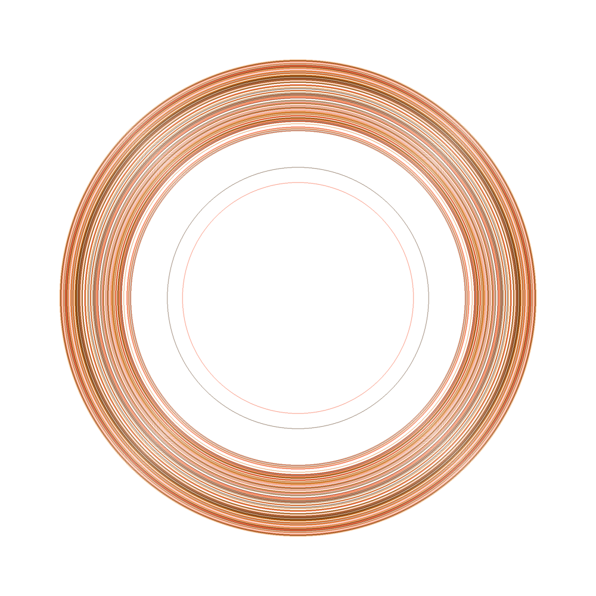

While visiting a local art show, I stumbled across the studio of [Nathaniel Price](https://www.artsy.net/artist/nathaniel-price). He had some amazing works on display from his series _"Further In"_. 

These large-format pieces reminded me of the rings of Saturn and the math geek in me couldn't help but notice the resemblance to certain mathematical distributions. I decided to write a quick python script to emulate this effect.

